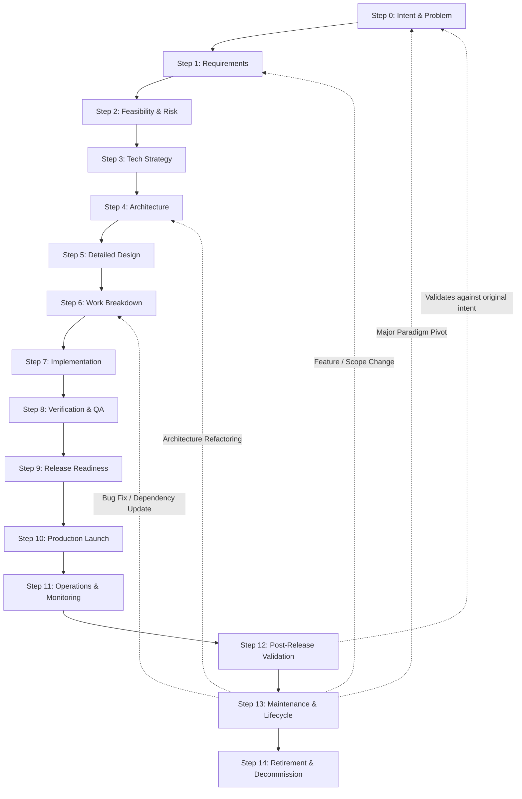

# The Complete Engineering Lifecycle & Swarm Architecture
**Status**: LOCKED & BASELINED  
**Scope**: Unified 15-Agent Engineering Governance Swarm  
**Architecture**: Closed-Loop Governed Intelligence  

---

## 1. Executive Master Lifecycle Table

The ecosystem is governed by **15 specialized, stage-gated agents** operating across the complete software lifecycle for new projects:

| Step | Agent Role | Focus & Core Question | Primary Artifact |
| :---: | :--- | :--- | :--- |
| **0** | [Agent 01: Problem Definition & Intent](file:///e:/New%20folder%20(2)/docs/agent-01-problem-intent.md) | **Why should we build this?** | `PROJECT_INTENT.md` |
| **1** | [Agent 02: Requirements Gathering](file:///e:/New%20folder%20(2)/docs/agent-02-requirements-elicitation.md) | **What must it accomplish?** | `REQUIREMENTS_SPECIFICATION.md` |
| **2** | [Agent 03: Feasibility & Risk](file:///e:/New%20folder%20(2)/docs/agent-03-feasibility-risk.md) | **Can we realistically build it?** | `FEASIBILITY_AND_RISK_REPORT.md` |
| **3** | [Agent 04: Technology Strategy](file:///e:/New%20folder%20(2)/docs/agent-04-technology-strategy.md) | **What technologies should we use?** | `TECH_STACK_AND_STRATEGY.md` |
| **4** | [Agent 05: System Architecture](file:///e:/New%20folder%20(2)/docs/agent-05-system-architecture.md) | **How will the system be structured?** | `SYSTEM_ARCHITECTURE_BLUEPRINT.md` |
| **5** | [Agent 06: Detailed Technical Design](file:///e:/New%20folder%20(2)/docs/agent-06-detailed-technical-design.md) | **Exactly how does each part work?** | `DETAILED_TECHNICAL_DESIGN.md` |
| **6** | [Agent 07: Implementation Planning](file:///e:/New%20folder%20(2)/docs/agent-07-implementation-planning.md) | **What will we build and in what order?** | `IMPLEMENTATION_PLAN_AND_WBS.md` |
| **7** | [Agent 08: Implementation / Development](file:///e:/New%20folder%20(2)/docs/agent-08-implementation-development.md) | **Build and construct the software.** | `IMPLEMENTED_RELEASE_CANDIDATE.md` |
| **8** | [Agent 09: Verification, Validation & QA](file:///e:/New%20folder%20(2)/docs/agent-09-verification-qa.md) | **Did we build it correctly & does it work?** | `VERIFICATION_AND_QA_PACKAGE.md` |
| **9** | [Agent 10: Release & Production Readiness](file:///e:/New%20folder%20(2)/docs/agent-10-production-readiness.md) | **Is it safe and ready to release?** | `RELEASE_AND_PRODUCTION_READINESS.md` |
| **10** | [Agent 11: Deployment & Launch](file:///e:/New%20folder%20(2)/docs/agent-11-deployment-launch.md) | **Put it into production safely.** | `PRODUCTION_LAUNCH_RECORD.md` |
| **11** | [Agent 12: Production Operations](file:///e:/New%20folder%20(2)/docs/agent-12-operations-monitoring.md) | **Keep the system healthy & stable.** | `OPERATIONS_AND_INCIDENT_RECORD.md` |
| **12** | [Agent 13: Post-Release Product Validation](file:///e:/New%20folder%20(2)/docs/agent-13-product-validation.md) | **Did it achieve the intended outcome?** | `PRODUCT_VALIDATION_PACKAGE.md` |
| **13** | [Agent 14: System Lifecycle & Maintenance](file:///e:/New%20folder%20(2)/docs/agent-14-lifecycle-maintenance.md) | **How do we safely evolve the system?** | `SYSTEM_LIFECYCLE_RECORD.md` |
| **14** | [Agent 15: Decommissioning & Retirement](file:///e:/New%20folder%20(2)/docs/agent-15-retirement-decommission.md) | **How do we safely shut it down?** | `DECOMMISSIONING_AND_RETIREMENT_RECORD.md` |

---

## 2. Closed-Loop Feedback & Routing Engine

The software lifecycle is **not a one-way street**. It is a **governed closed loop** where live feedback and changes route back to the appropriate upstream agent:

---

## 3. The 4 Universal Governance Invariants

1. **Deterministic Stage Gates**: No downstream agent may start work until the immediate upstream artifact has been completed, reviewed, and sealed with a cryptographic hash.
2. **Strict Boundary Adherence**: Every agent has explicit banned activities. For example, Agents 0–2 cannot choose technologies or write code; Agent 08 cannot authorize production deployments.
3. **The "Top 3 Options" Socratic Rule**: Whenever ambiguity, conflicting stakeholder needs, or technical trade-offs arise, the active agent must provide the **top 3 industry options with consequences and trade-offs** before locking.
4. **Universal Traceability & Anti-Drift**: Every line of code, test case, deployment script, and alert must link bidirectionally back to an approved requirement in Step 1 and the problem intent in Step 0.
