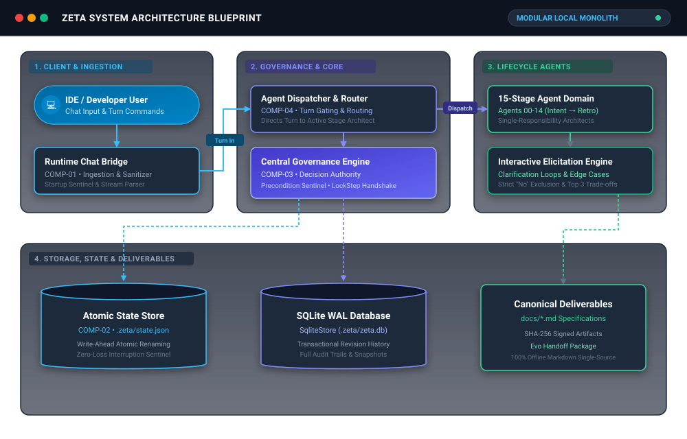
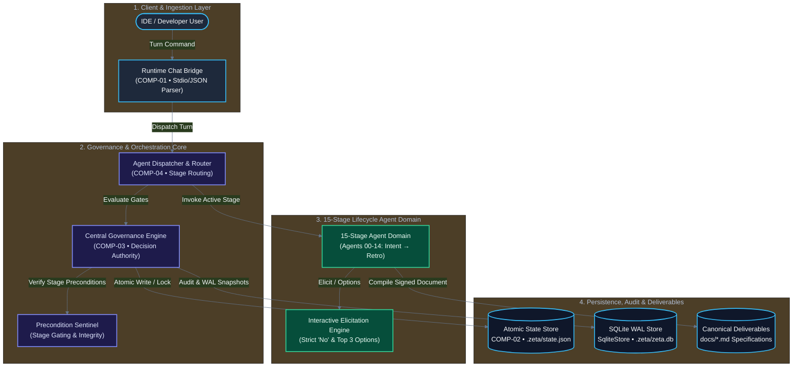

# SYSTEM ARCHITECTURE & SOLUTION DESIGN BLUEPRINT
**Stage**: Step 4 — System Architecture & Solution Design  
**Status**: LOCKED  
**Authority**: Single Source of Truth for System Partitioning, Failure Modes & ADRs  

---

## 1. Upstream Context Baselines
> **Step 0 Intent TL;DR**:  
> TL;DR PROJECT INTENT (Step 0 Baseline):
> • Core Problem: Greenfield software projects built with AI agents suffer from scope creep, lack of verification, and fragmented state because existing tools lack a deterministic, local 15-stage lifecycle governance engine.
> • Vision & Purpose: Production-grade, local-first npm CLI governance engine with Antigravity IDE integration, typed SQLite store, and 15-stage lifecycle enforcement.
> • Primary User: Autonomous AI agents, software engineers, technical leads, and engineering directors.
> • Core In-Scope: Antigravity-integrated CLI (zeta), 15-stage sequential lifecycle (Stages 0-14), Typed SQLite state store with WAL mode and crash recovery, Centralized GovernanceEngine with exact case-insensitive Approve gating, Idempotent migration from legacy state.json
> • Strictly Out-of-Scope: Codex, Cursor, and Claude Code integrations (Antigravity CLI target only), Cloud telemetry or remote persistence services, Self-approving or auto-advancing agent autonomy
> • Gating Verdict: GO — Proceed to Step 1 Requirements Elicitation.

> **Step 1 Requirements TL;DR**:  
> TL;DR REQUIREMENTS SPECIFICATION (Step 1 Baseline):
> • Functional Scope: 5 FRs baselined (FR-01 (Canonical 15-Stage Lifecycle & Routing Engine), FR-02 (GovernanceEngine Centralized Approval & Gating), FR-03 (Typed SQLite State Store with WAL Concurrency)).
> • Key NFR Thresholds: Low Latency Turn Execution: < 50ms; Atomic Interruption Recovery & Crash Safety: 100% recovery without state loss.
> • Data Model: Local-first .zeta/state.json + docs/*.md.
> • Strict Exclusions: No legacy reverse-engineering; zero cloud daemons.
> • Gating Verdict: GO — Proceed to Step 2 Feasibility & Risk Assessment.

> **Step 2 Feasibility & Risk TL;DR**:  
> TL;DR FEASIBILITY & RISK (Step 2 Baseline):
> • Feasibility Verdict: GO — Core architecture is fully viable in local-first environment.
> • Constraints Locked: CON-01, CON-02, CON-03.
> • Material Risks Mitigated: 3 risks addressed (RISK-01 (Windows SQLite Lock Collisions in Concurrency Tests); RISK-02 (Legacy JSON Migration with Missing or Altered Artifacts)).
> • Dependencies: Local file system and Node.js extension host (zero cloud daemons).
> • Gating Verdict: GO — Proceed to Step 3 Technology Strategy Architect.

> **Step 3 Tech Stack TL;DR**:  
> TL;DR TECH STACK & STRATEGY (Step 3 Baseline):
> • Core Stack: Node.js LTS + TypeScript strict + atomic file storage.
> • Key TDRs: RUNTIME_LANGUAGE: Node.js LTS (>=20.0.0 <25.0.0) + TypeScript 5.x; DATA_STORAGE: SQLite3 (better-sqlite3) with WAL Mode; BUILD_PACKAGING: zod Schema Engine; COMMUNICATION_PROTOCOL: POSIX Stdin/Stdout JSON Streaming; TESTING_FRAMEWORK: Node.js Native Test Runner (node:test) + tsx.
> • Testing: Native node:test runner with tsx (zero runner bloat).
> • Prohibited: External background servers / cloud daemons.
> • Gating Verdict: GO — Proceed to Step 4 System Architecture Architect.

---

## 2. Architectural Style & C4 Structural Decomposition
* **Architecture Style**: Modular Local-First Governance Engine with Inverted Ingestion Bridge

<b>View Mermaid Architecture Blueprint</b>

---

## 3. Core Architectural Components

### COMP-01: CLI Ingestion Bridge (RUNTIME_BRIDGE)
* **Responsibility**: Receives user inputs via POSIX stdin/stdout, parses JSON within 512 KiB limit, maps exit codes
* **Inputs**: Process argv, Stdin stream (UTF-8 JSON)
* **Outputs**: Structured CLI response, Process exit codes (0..4)
* **Failure Behavior**: Emits structured error JSON to stderr and exits with non-zero exit code

### COMP-02: GovernanceEngine (GOVERNANCE_ENGINE)
* **Responsibility**: Central decision authority for approving, locking, invalidating, and advancing stages 0–14
* **Inputs**: Approval commands, Agent proposed drafts, Step numbers
* **Outputs**: Locked stage state, Canonical docs/*.md files, Step advance
* **Failure Behavior**: Rolls back transaction, leaves current stage unchanged, reports specific gate failure

### COMP-03: SQLite State Store (IStateStore) (STATE_PERSISTENCE)
* **Responsibility**: Atomically persists session state, revisions, artifact snapshots, and audit log using WAL mode
* **Inputs**: SessionState, Artifact snapshots, Audit events
* **Outputs**: Active state queries, Integrity check results, Online backup files
* **Failure Behavior**: Retries on busy timeout (5000ms); aborts transaction on unrecoverable disk error

### COMP-04: LifecycleAgent Dispatcher (AGENT_DISPATCHER)
* **Responsibility**: Dispatches turns to specialized Agents 01–15; enforces draft validation without self-approval
* **Inputs**: User turns, Active stage number, Rehydrated uncommitted buffer
* **Outputs**: AgentTurnResult containing proposed draft or clarifying questions
* **Failure Behavior**: Returns validation error envelope without advancing stage

---

## 4. Failure Mode & Effect Analysis (FMEA)

| ID | Component | Failure Trigger | Severity | Containment | Recovery |
| :--- | :--- | :--- | :--- | :--- | :--- |
| FMEA-01 | CLI Ingestion Bridge | Malformed UTF-8 or stream > 512 KiB | MEDIUM | Truncation check and byte-length guard in stream collector | Emit JSON error: BUFFER_OVERFLOW or INVALID_UTF8 and exit with code 2 |
| FMEA-02 | GovernanceEngine | Process killed mid-approval transaction | HIGH | Atomic SQLite transaction wraps state update and snapshot insert | SQLite automatically rolls back uncommitted WAL transaction on next open |
| FMEA-03 | SQLite State Store | Stale .zeta/zeta.lock left by killed process | MEDIUM | Record PID and heartbeat timestamp inside lock file | zeta doctor --unlock detects dead PID and removes stale lock file |

---

## 5. Architecture Decision Records (ADRs)

### ADR-01: Centralized Approval Authority in GovernanceEngine
* **Status**: ACCEPTED
* **Context**: Previously, individual agents handled their own approval strings, leading to inconsistent gating and accidental self-advancement.
* **Decision**: Move all approval evaluation, stage gating, artifact disk writes, and stage advance into GovernanceEngine.
* **Consequences**: Agents become purely advisory draft generators; lifecycle progression is 100% deterministic and centralized.

### ADR-02: SQLite WAL Mode with Advisory Process Lock
* **Status**: ACCEPTED
* **Context**: Concurrent CLI processes on Windows can experience file lock conflicts on sqlite databases.
* **Decision**: Enable PRAGMA journal_mode=WAL, busy_timeout=5000, and use a dedicated .zeta/zeta.lock advisory file lock.
* **Consequences**: Eliminates lock collision crashes while allowing non-blocking readers.

### ADR-03: Canonical 15-Stage Lifecycle Registry
* **Status**: ACCEPTED
* **Context**: Prototype had numbering drift between 0-6 and 01-15.
* **Decision**: Define canonical lifecycle map in src/core/lifecycle/lifecycle-map.ts with Stages 0–14 mapping directly to Agents 01–15.
* **Consequences**: Single source of truth for CLI, tests, documentation, and Antigravity skill.

### ADR-04: Crash-Safe Artifact-Verified Migration
* **Status**: ACCEPTED
* **Context**: Migrating legacy state.json can produce corrupt SQLite state if disk files are missing.
* **Decision**: Import canonical docs/*.md artifacts from disk, compute and verify SHA256 hashes, and retain a timestamped backup before touching legacy state.
* **Consequences**: Guarantees zero data loss and prevents corrupted snapshots from entering the database.

---

## 6. Architecture Baseline Lock & Handshake
* **Readiness Verdict**: **LOCKED & VERIFIED**
* **Traceability**: All components trace directly to Step 1 Requirements and Step 3 Technology selections.
* **Gating Authority**: Step 4 approved. Cleared to proceed to Step 5: Detailed Technical Design Architect.
